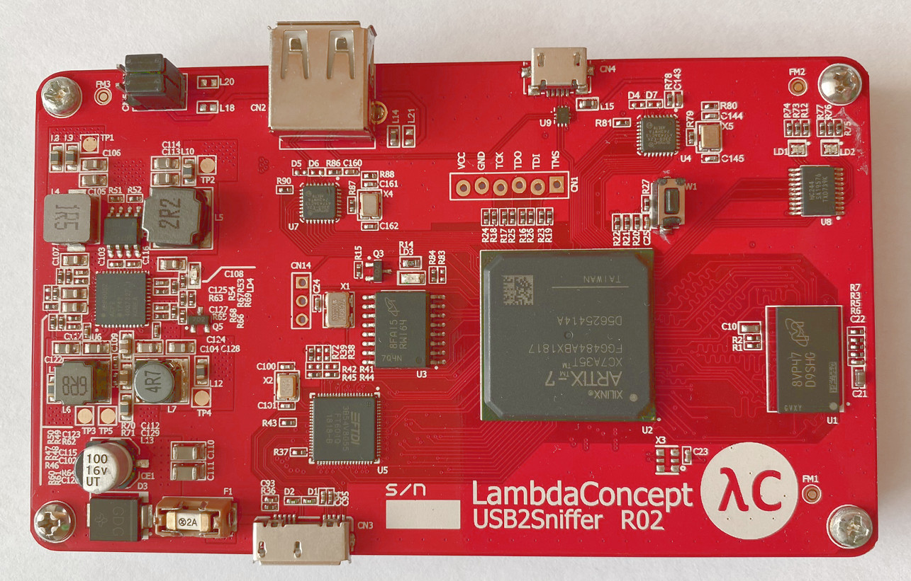
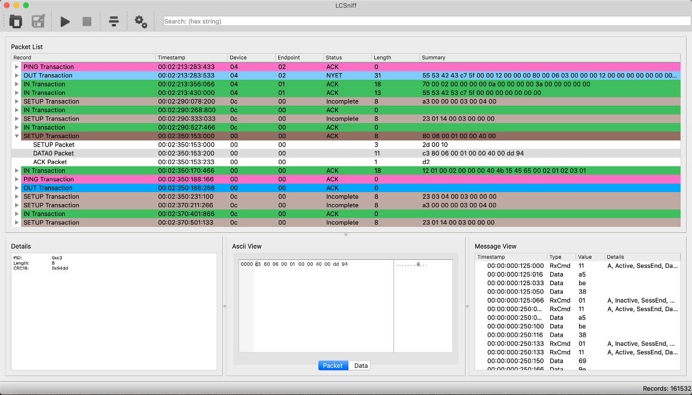
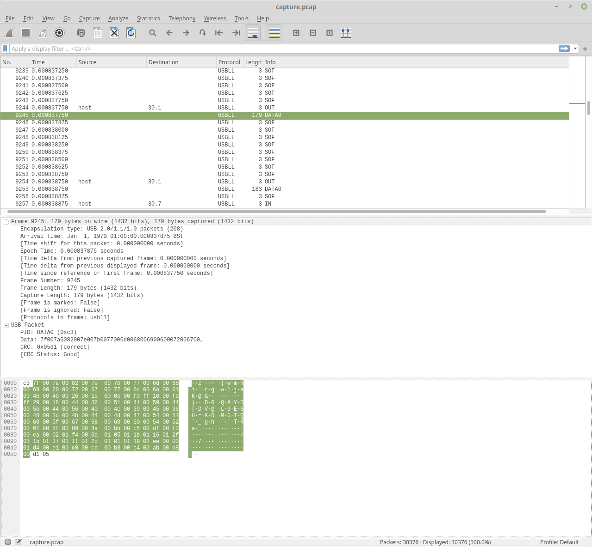

# USB2.0 Capture Project (for LambdaConcept USB2Sniffer hardware)

Github: [https://github.com/ultraembedded/usb2sniffer](https://github.com/ultraembedded/usb2sniffer)

## Intro
This repo contains an alternative set of FPGA gateware and SW for performing USB2.0 capture with the [LambaConcept USB2Sniffer](http://blog.lambdaconcept.com/doku.php?id=products:usb_sniffer) FPGA board ([buy](http://shop.lambdaconcept.com/home/35-usb2-sniffer.html)).


## Getting Started

#### Cloning

To clone this project and its dependencies;

```
git clone --recursive https://github.com/ultraembedded/usb2sniffer.git

```

#### Usage

With the bitstream loaded onto the target board, the following sequence can be used to capture some USB traffic;

```
# Build the command line applications
cd sw
make

# Start a capture
./capture/capture -f /tmp/capture.bin

# Convert to PCAP
./convert/convert -f /tmp/capture.bin -o capture.pcap

# Convert to txt file
./convert/convert -f /tmp/capture.bin -o capture.txt

# Convert to USB file (readable using LcSniff)
./convert/convert -f /tmp/capture.bin -o capture.usb
```

#### LambdaConcept Lcsniff

After converting captured data from binary to .usb file format, the [LambdaConcept Lcsniff GUI](https://github.com/lambdaconcept/usb2sniffer-qt) can be used to view the captured data;



#### Wireshark - Raw USB (DLT_USB_2_0)

To view PCAPs with Wireshark, a recent version is required (>= 2019).

To get a recent dev build of Wireshark on Ubuntu/Debian/Mint;
```
sudo add-apt-repository ppa:wireshark-dev/stable
sudo apt-get update
sudo apt-get install wireshark
```



#### Wireshark - Decoded data (DLT_USB_LINUX)

Wireshark has some more advanced protocol dissectors available if you are willing to lose some lower-level USB details;
```
./usbmonpcap/usbmonpcap -f /tmp/capture.bin -o capture.pcap
```


## IP Designs Used

Most of the IP cores used in this project are designed by myself and available as easy to follow open-source Verilog modules.
The remainder (DDR3, CDC, PLL) are IP cores built with Xilinx Vivado.

| Name                   | Description                                                 | Provider |
| ---------------------- | ------------------------------------------------------------| -------- |
| usb_sniffer            | [USB Sniffer Core](https://github.com/ultraembedded/core_usb_sniffer) | - |
| ulpi_wrapper           | [ULPI PHY Interface](https://github.com/ultraembedded/core_ulpi_wrapper) | - |
| ft60x_axi              | [FTDI USB3.0 to AXI bus master](https://github.com/ultraembedded/core_ft60x_axi) | - |
| mig_axis.xci           | [MIG DDR3 Controller](https://github.com/ultraembedded/usb2sniffer/blob/master/cores/ddr/mig_axis.xci) | Xilinx |
| axi_cdc_buffer.xci     | [AXI4 Clock Domain Converter](https://github.com/ultraembedded/usb2sniffer/blob/master/cores/cdc/axi_cdc_buffer.xci) | Xilinx |
